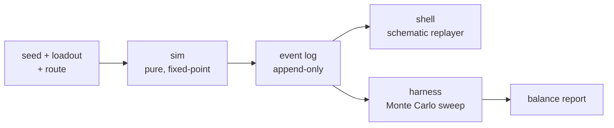
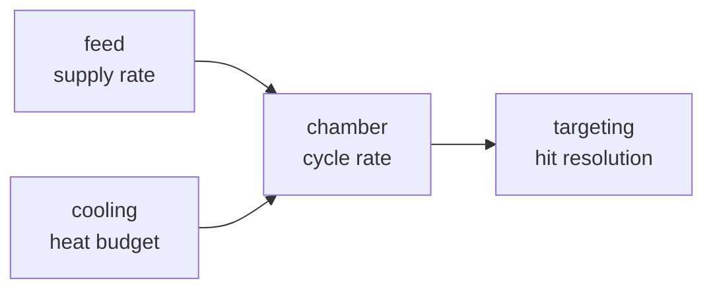
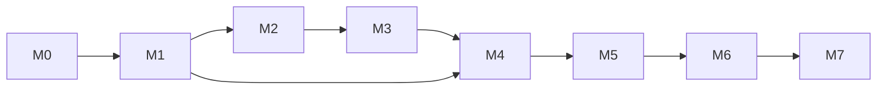

# Loadout Compiler — Build Plan & Agent Specs

2026-09-18 · @Matt

## Concept and design pillars

Loadout Compiler is a mobile roguelite about building a machine and then finding out whether it works. The player assembles a weapon system from modules, plots a route through a procedurally generated facility, and commits. The run executes as a deterministic simulation rendered as a top-down schematic, which the player watches and can scrub through. Death is diagnostic: the report names the module that choked and the tick it failed on.

The fantasy is engineering, not marksmanship. You win because you noticed that a high-cycle chamber starves behind a single-belt feed, not because your thumbs are fast.

### Core loop

1. Compile — draft modules and assemble a loadout under slot, power and heat constraints.
2. Route — pick a path through the facility from offered branches, each with known hazard classes and unknown specifics.
3. Resolve — the sim runs. The player watches the schematic and scrubs it.
4. Diagnose — the run report attributes failure to a subsystem and shows the numbers behind it.
5. Recompile — meta-unlocks add module types and capability, never raw stat increases.

### Pillars

- The machine is the character. All expression lives in module composition; no progression bypasses understanding the pipeline.
- Failure is legible. A loss the player cannot explain is a bug in the run report, not difficulty.
- Determinism is a feature. It buys shareable build codes, daily seeds, spectatable runs and an automated balance rig. It is load-bearing and defended by tests.
- No art pipeline. Schematic presentation is a deliberate constraint: vector primitives, a fixed token set, no illustrated assets.
- Mobile-native input. Every interaction is a tap or drag on a target of at least 44pt. No sustained precision input.

### Out of scope for v1

Multiplayer, real-time PvP, live-service events, 3D rendering, narrative campaign, cloud save conflict resolution beyond last-write-wins.

## Stack decision

Godot 4.7 with GDScript for both layers, integer fixed-point maths in the sim, exported natively to iOS and Android.

The reasoning: you already run Godot for Callsign, so the toolchain and export pipeline are known quantities. A top-down schematic is trivially cheap in Godot 2D. Critically, `godot --headless --script harness/sim_cli.gd` gives the agent a command-line entry point for the balance rig without introducing a second language or an FFI boundary — the same code the game runs is the code the harness tests.

### Fixed-point, not floats

All sim arithmetic uses `int` in fixed-point (1 unit = 1/1024). Float determinism across ARM and x86 is not guaranteed, and the whole design leans on a seed reproducing identically on a phone, on your desktop, and in CI. A small `Fx` helper module provides multiply, divide and the handful of curves needed. This is non-negotiable and belongs in M0, because retrofitting it means rewriting every rule.

### The known performance limit

GDScript will not run 10,000 full sims in 30 seconds. Mitigations, in order:

1. Fan the sweep across processes — one headless instance per core.
2. Use 2,000 samples for the interactive iteration loop and a 20,000-sample sweep nightly.
3. Strip event-log emission during sweeps (outcome and attribution only), which is the bulk of the cost.

If profiling after M2 still shows the loop too slow to iterate on, port `sim/` to a Rust GDExtension. By then the sim is pure, fully specified and covered by golden files, so the port is mechanical and verifiable against existing snapshots. Do not start there — a GDExtension build adds cross-compilation for two mobile targets to the very first milestone.

### Third-party dependencies

None in `sim/`. Ever. The shell may use Godot's own nodes and nothing else in v1.

## Architecture

The game is a deterministic simulation with a renderer bolted on. This single split is what makes the project agent-buildable: roughly 80% of the work lives in a layer that needs no pixels, no device and no human judgement to verify.



The event log is the only interface. The shell and the harness are both consumers of it and neither may reach into sim state.

### Contracts

| Layer | May depend on | Owns | Never does |
| --- | --- | --- | --- |
| `sim` | `Fx`, `/data` | All game rules | Touch the scene tree, RNG, clock or I/O |
| `shell` | `sim` types (read-only), Godot | Rendering, input, UI | Contain any rule or number |
| `harness` | `sim` | Sweeps, reports | Modify `/data` |
| `data` | nothing | Every balance number | Contain logic |

### Why the renderer must be a pure function of the log

If the shell can compute anything itself, two things break at once: scrubbing backwards stops being correct, and the harness stops being a valid model of the game. Enforce it with a test — render tick N by playing the log forward from zero, then again by jumping directly to N, and assert the resulting view state is identical.

### Event log format

Append-only array of records: `{tick, kind, subject, payload}`. Kinds are a closed enum (`fire`, `jam`, `vent`, `spawn`, `hit`, `kill`, `damage_taken`, `module_offline`, `room_enter`, `run_end`). The log is the save format for replays, the input to the run report, and the thing that gets hashed for the determinism test. Keep records small — a full run should serialise under 64 KB so replays can be shared as build codes plus a seed rather than as logs.

## Repo layout

```
/sim          pure GDScript — no scene tree, no engine calls
  fx.gd         fixed-point maths
  rng.gd        xorshift128+, explicitly seeded and passed
  loadout.gd    module assembly and validation
  pipeline.gd   feed → chamber → cooling → targeting resolution
  encounter.gd  per-room combat resolution
  facility.gd   route and room generation
  run.gd        the top-level run loop; returns an event log
  log.gd        event log construction and hashing
/data         TOML — every balance number
  modules/      one file per module
  enemies/
  rooms/
  tuning.toml   global curves and constants
/harness      CLI, sweep runner, report generator
/shell        scenes, schematic renderer, UI, audio
/tests        determinism, golden files, schema validation, perf
/tools        lint rules, data validator, build scripts
/docs         this plan, plus one spec file per milestone
```

### Import rules the linter enforces

- Nothing under `sim/` may reference `Node`, `Engine`, `Time`, `OS`, `Input`, `randf`, `randi`, `randomize`, or any `res://shell` path.
- Nothing under `shell/` may write to sim state or contain a numeric literal outside layout and styling constants.
- Nothing under `harness/` may write to `data/`.
- `sim/` may not read files at runtime; `/data` is parsed once at load into typed structs and passed in.

The lint is a script in `tools/` run in CI, not a convention in a README. If it is only a convention, the agent will break it in week two and nobody will notice until determinism fails for a reason nobody can find.

## Data schemas

Every balance number lives in `/data` as TOML, validated against a JSON Schema in `tools/schema/`. No balance literal ever appears in GDScript. This is what lets you patch balance after launch without shipping a binary, and it is what lets the agent tune by editing data rather than rewriting rules.

### Module

```toml
id = "feed.twin_belt"
slot = "feed"          # feed | chamber | cooling | targeting
tier = 2
name_key = "mod.feed.twin_belt"

[cost]
power = 14
mass = 8
slots = 1

[provides]
supply_rate = 2400     # fixed-point units per 100 ticks
buffer = 60

[requires]
power_min = 10

[heat]
generated = 30         # per cycle

[failure]
mode = "starve"        # starve | jam | overheat | offline
threshold = 0

[tags]
list = ["belt", "mechanical"]
```

### Enemy archetype

```toml
id = "drone.swarm"
hp = 40
armour = 0
speed = 180
threat = 1

[behaviour]
kind = "rush"          # rush | ranged | shielded | burrow | splitter
engage_range = 400

[damage]
per_hit = 6
interval = 45

[resist]
kinetic = 0
thermal = -25          # negative = vulnerable, percent
```

### Room type

```toml
id = "room.choke"
hazard_class = "attrition"   # shown to the player before committing
depth_range = [2, 6]

[spawn]
budget_base = 120            # threat budget, scaled by tuning curve
waves = 3
archetype_weights = { "drone.swarm" = 60, "drone.ranged" = 40 }

[modifier]
heat_dissipation = -20       # percent
```

### Rules for the agent when adding data

- Every new module must declare a `failure.mode`. A module that cannot fail is a module with no interesting decision attached to it.
- Every stat is an integer. Percentages are integers meaning percent. No floats in data files.
- `name_key` is a localisation key, never display text, from the first module onward.
- Adding a module requires adding it to the sweep matrix in the same commit, so it cannot enter the game unbalanced.
- `tuning.toml` holds the global curves (depth scaling, threat budget growth, unlock pacing). Room and module files never re-implement a curve.

## Sim model

One run is a sequence of rooms. Each room is a fixed-tick encounter at 60 ticks per second of simulated time, resolved as fast as the CPU allows. A room ends when the spawn budget is exhausted and no enemies remain, or when the player's integrity hits zero.

### The pipeline

The loadout is a chain, and throughput is limited by its worst stage. This is the central decision space.



- **Feed** supplies units into a buffer at `supply_rate`. If the buffer empties, the chamber starves and emits `jam` events until supply recovers.
- **Chamber** consumes buffer per cycle and generates heat. Its cycle rate is the ceiling on damage output.
- **Cooling** removes heat per tick. If accumulated heat exceeds the budget, the chamber goes offline for a penalty window.
- **Targeting** converts a fired cycle into hits against the current enemy set — it decides how many enemies a cycle can touch and how much of its damage lands against armour.

The interesting builds are the ones that balance these four against each other. The trap builds are the ones that maximise one.

### Tick order

Fixed and documented, because changing it silently invalidates every golden file:

1. Advance room timeline; resolve scheduled spawns.
2. Dissipate heat.
3. Advance feed; fill buffer.
4. Attempt chamber cycle; deduct buffer; add heat; emit `fire` or `jam`.
5. Resolve targeting; apply damage; emit `hit` and `kill`.
6. Advance enemies; resolve their attacks; emit `damage_taken`.
7. Check end conditions; emit `run_end` if met.

### Randomness

A single seeded `rng.gd` instance, threaded explicitly through every call that needs it. No module may hold its own RNG. Draws happen in a fixed order per tick, so adding a draw anywhere changes every downstream result — which is why golden files exist.

RNG is used for: facility generation, spawn selection within archetype weights, and targeting spread. It is deliberately **not** used for damage rolls. Damage is deterministic given the state, so that a player who understands their build can predict its output. Variance comes from what you face, not from dice.

### Run report

Produced from the event log, not from sim internals. It must answer one question: what killed you? Concretely, the first subsystem whose failure events precede the damage spike that ended the run, plus its numbers (heat at failure, buffer at failure, cycles lost). The report is a first-class deliverable, not UI polish — pillar two depends on it.

## Determinism and agent guardrails

These exist because an agent working across many sessions will otherwise reintroduce nondeterminism, and nondeterminism in this design is not a bug — it is the collapse of the feature set.

### Tests that gate every commit

| Test | Asserts | Fails the build when |
| --- | --- | --- |
| Hash | Same seed and loadout produce a byte-identical event log hash | Any rule change is made without acknowledging it |
| Golden files | 12 canned runs match committed snapshots | Output drifts unintentionally |
| Cross-platform hash | CI runs the same seeds on x86 and ARM | Fixed-point discipline slips |
| Lint | No banned API appears under `sim/` | Engine or RNG creeps into the sim |
| Schema | Every `/data` file validates | A malformed module ships |
| Perf | 2,000-sim sweep completes inside budget | A rule change is accidentally quadratic |
| Save migration | A v1 save loads into the current schema | A save-breaking change ships silently |

### Golden file discipline

Golden files may only change in a commit that touches nothing else and whose message begins `BALANCE:` or `RULES:`. The agent is forbidden from regenerating snapshots to make a failing test pass — that is the single most likely way this project quietly breaks. State it explicitly in the agent's instructions file.

### Sim versioning

`sim/VERSION` is an integer, bumped by any change that alters output for an existing seed. Daily seeds, leaderboards and shared build codes are all stamped with it. A run recorded under version 4 is never compared against a version 5 run. Without this, the first balance patch invalidates all history and there is no way to detect it.

### Save format

Versioned from the first commit, with a migration function per version step and a test that walks v1 through to current. Shipped games accumulate old saves within hours.

## Balance harness and targets

This is the phase that justifies building this game agentically. Balance is normally the work that most needs a human with taste and thousands of hours of play. Here it becomes a measurement problem with numeric targets an agent can iterate against overnight.

### The rig

```
harness/sweep.gd --matrix loadouts.toml --seeds 2000 --out reports/
```

For each loadout in the matrix, run N seeds and emit:

- Win rate, and clear rate per depth.
- Time-to-kill distribution per enemy archetype (p10, p50, p90).
- First-choke attribution — which subsystem failed first, as a distribution.
- Damage-taken sources, as a share of total.
- Buffer and heat occupancy histograms, to spot stages that are never the constraint.

The loadout matrix is generated, not hand-written: every legal combination at each tier, plus a random sample of mixed-tier builds. An agent can also run a hill-climb over the matrix to find the strongest build, which is the fastest way to surface a degenerate combination.

### Targets to tune against

| Metric | Target | Why |
| --- | --- | --- |
| Median loadout win rate | 35–45% | Runs feel winnable but not assured |
| Best discoverable build win rate | below 75% | No build solves the game |
| Distinct builds clearing the game | 8 or more | Real breadth, not one path |
| Any single module's share of winning builds | below 60% | No mandatory pick |
| Trap builds (plausible, loses) | 3 or more | Rewards understanding |
| First-choke spread across 4 subsystems | none above 50% | All four stages matter |
| Median run length | 6–9 minutes | Mobile session |

### How the agent uses it

Edit `/data`, run the sweep, compare against targets, repeat. Each tuning commit includes the report diff, so the effect of a change is visible in the history. Balance moves are data-only commits — if a tuning pass needs a code change, that is a finding about the model, and it goes back through the rules process with a golden-file update.

### The limit of this method

The harness measures whether the numbers work. It cannot measure whether the game is interesting. The review gate after this milestone is you reading the report and playing ten runs, not the agent declaring success.

## Milestones

One milestone per agent session where possible. Each has a machine-checkable exit criterion, because "done" claimed against prose is unverifiable.

### M0 — Skeleton and CI

Repo structure, `Fx` fixed-point module, seeded RNG, event log with hashing, empty `/data` with schemas, lint rules, golden-file infrastructure, GitHub Actions running the lot. Save schema v1 with a migration harness that currently migrates nothing.

**Exit:** CI green. `sim run --seed 1234` emits a stable hash across two consecutive runs and across x86 and ARM runners. Lint fails on a deliberately planted `randf()` in `sim/`.

### M1 — Sim core

The pipeline, heat and buffer model, encounter resolution, facility and route generation, run loop. Enough `/data` for four modules per slot and four enemy archetypes.

**Exit:** 1,000 randomly generated legal loadouts run to completion — no crashes, no non-terminating runs, no negative-resource states. A fuzz test over malformed loadouts fails gracefully with named errors.

### M2 — Balance harness

Sweep runner, report generator, generated loadout matrix, hill-climb search.

**Exit:** 50 loadouts × 2,000 seeds completes in under two minutes on 8 cores, emitting a committed report artefact with win rate, TTK spread and first-choke attribution.

### M3 — Balance to targets

Data-only iteration against the targets table. Expand content to roughly eight modules per slot and eight archetypes as the space is validated.

**Exit:** every row in the targets table met, with the report committed as evidence. **Human review gate** — you read the report and play ten runs.

### M4 — Schematic shell

Top-down renderer driven purely by the event log. Playback with pause, step, scrub, and jump-to-failure. Design token set locked: palette, line weights, icon grammar, minimum touch target. Both portrait and landscape are supported, with rotation permitted mid-run — anchors and containers only, no absolute positioning.

**Exit:** renderer proven a pure function of the log by the forward-vs-jump equality test. 60fps sustained on a Pixel 6a during the heaviest committed golden run. Layout tests pass at both reference viewports — 1080 × 2400 portrait (the base resolution) and 2400 × 1080 landscape — and a rotate-mid-run case leaves the log hash unchanged. No numeric game constant anywhere under `shell/`.

### M5 — Compiler UI and meta

Build screen with slot constraints and live projected stats, draft flow, route selection, run report screen, unlock tree, run history, daily seed, share codes.

**Exit:** a full run is playable end to end on device with no debug affordances. Share code round-trips: encode a build, decode it on a second device, produce an identical hash. Save migration test passes v1 to current.

### M6 — Onboarding and feel

First-run tutorial, sound, haptics, readability pass, accessibility (colour-blind safe palette, text scaling, reduced motion).

**Exit:** **human gate, not agent-verifiable.** Five people who have never seen the game complete a run and can explain what killed them. That last clause is the actual test.

### M7 — Ship

Store listings, screenshots, privacy policy, monetisation implementation, analytics, crash reporting, localisation extraction, beta channel.

**Exit:** the checklist in the next section, fully ticked.

### Dependency shape



M4 can begin against M1's sim while M3 tuning continues, provided the renderer is written against the event log contract rather than against current balance.

## Open design decisions

### Mid-run interventions — decide before M4

A spectated deterministic run is passive, and passivity is the difference between an interesting experiment and something anyone plays twice. The proposal: the player gets a small budget of interventions — say three per run — that pause the sim and allow one action each, such as venting heat, rerouting the feed, or swapping a targeting mode.

The cost is real. Interventions mean the sim takes player input mid-run, so a run is no longer reproducible from seed and loadout alone; it needs the intervention log too. Share codes and daily-seed comparison then have to carry that log. This is a small change at M1 and a painful one once the replayer exists at M4.

**Options:**

1. **No interventions.** Purest version, simplest sim, fully reproducible from a build code. Highest risk of the game feeling like a spreadsheet that plays itself.
2. **Interventions, logged.** Run inputs become `(seed, loadout, route, interventions[])`. Determinism is preserved — it is still a pure function, just with more arguments. Costs a slightly larger share code and a UI for spending them.

Recommendation is option 2, built in at M1 as a list of `{tick, action}` records even if the UI arrives at M5. Building the plumbing early costs little; adding it late means touching every golden file.

### Second open question

Whether the facility route carries meaningful strategic choice in v1 or is a straight line with varied rooms. A branching route adds a second decision layer but also multiplies the content needed to make branches feel distinct. Defer to M3, when the sweep can show whether route choice measurably changes outcomes or is noise.

## Ship checklist

- [ ] Monetisation decided and implemented — free at launch, with no ads and no IAP; revisit only once there is retention data from real players
- [ ] Apple and Google developer accounts, certificates, provisioning, signing in CI
- [ ] Store listings, keyword research, screenshots generated from real runs, preview video
- [ ] Privacy policy and store data-safety declarations matching what analytics actually collects
- [ ] Analytics taxonomy defined before events are added — run completions, build composition, drop-off point, choke attribution in the wild
- [ ] Crash and error reporting wired, with sim version and seed attached to every report so any crash is reproducible
- [ ] Localisation extraction verified — every user-visible string behind a key, English as the only shipped locale in v1
- [ ] Accessibility: colour-blind safe palette, text scaling, reduced motion, no information conveyed by colour alone
- [ ] Device matrix tested — two low-end Android, one mid Android, two iOS generations
- [ ] Cold start under three seconds on the floor device
- [ ] Offline play confirmed; daily seed degrades gracefully with no connection
- [ ] Closed beta run through TestFlight and Google Play internal testing
- [ ] Support contact and a crash-to-support path
- [ ] Post-launch balance patch path proven end to end — ship a data-only change to beta and confirm it applies without a binary update

### The one that gets forgotten

Analytics on choke attribution is the highest-value item in this list. It tells you which subsystem real players fail at, which is exactly the input the balance harness needs to stop being a model and start being calibrated against reality.

## Working with the agent

### Session discipline

One milestone per session. Start each session by pointing the agent at `docs/M<n>.md` and this plan, and require it to restate the exit criterion before writing code. End each session with the exit criterion demonstrably met or explicitly not met — never "mostly working".

### Definition of done

A milestone is done when its exit criterion passes in CI on a clean checkout. Not when the agent says it works, not when it works on your machine. The exit criteria in this plan are written to be executable for exactly this reason.

### Standing rules for the agent's instructions file

Put these in `CLAUDE.md` at the repo root, not in a session prompt, so they survive every session:

- Never regenerate golden files to make a test pass. A failing golden file means a rule changed; report it and stop.
- Never add a numeric balance value to GDScript. It goes in `/data`.
- Never import Godot APIs under `sim/`.
- Never widen a test's tolerance to make it pass.
- If an exit criterion cannot be met, stop and report why rather than adjusting the criterion.
- Every commit that changes sim behaviour bumps `sim/VERSION` and says so in the message.

### Where the agent will be weakest

M6, and it is worth being blunt about it. Feel, readability, pacing and onboarding are judgement calls with no test to hang them on. Budget your own time there rather than expecting a harness to cover it. Everything before M6 is genuinely automatable; M6 is the project's actual bottleneck and the reason a schematic-only art direction was chosen — it keeps the human-judgement surface as small as possible.

### Suggested first session prompt

> Read `docs/plan.md` and `docs/M0.md`. Restate M0's exit criterion. Then implement M0 only: repo structure, fixed-point maths, seeded RNG, event log with hashing, data schemas, lint rules, golden-file infrastructure and CI. Do not implement any game rules. Stop when CI is green and the planted `randf()` lint test fails as expected.
